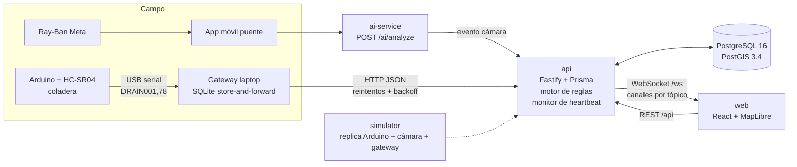

# Arquitectura

## Vista general

En Docker, `web` es nginx: sirve el SPA y hace proxy de `/api/*` y `/ws` hacia `api:3000`. El navegador habla con un solo origen: no hay CORS ni URL de API incrustada en el build.

## Servicios

| Servicio | Tecnología | Puerto | Responsabilidad |
| --- | --- | --- | --- |
| `postgres` | postgis/postgis:16-3.4 | 5432 | Persistencia y consultas espaciales |
| `api` | Node 20, Fastify 5, Prisma 5, Zod | 3000 | REST, WebSocket, auth, motor de reglas, heartbeat |
| `web` | React 18, Vite, Tailwind 4, MapLibre (Fase 6) | 80 → host 5173 | Centro de control |
| `simulator` | Node 20, Fastify, SQLite (Fase 4) | 4000 interno | Coladeras, cámaras, gateway, modo sin Internet |
| `ai-service` | Python 3.12, FastAPI | 8000 interno | Análisis de imagen (mock), perfil `ai` |

## Decisiones y trade-offs

**npm workspaces en lugar de pnpm.** Viene con Node, no requiere instalar nada adicional en las laptops del equipo y el monorepo es pequeño (5 paquetes). pnpm ahorraría disco, pero añade un paso de instalación y symlinks estrictos que complican los Dockerfiles.

**Fastify en lugar de Express.** Validación y serialización por esquema, logger estructurado (pino) con redacción de campos sensibles, y mejor rendimiento para ráfagas de lecturas de sensores.

**Columnas `geom` generadas por PostGIS.** Cada tabla con punto guarda `latitude`/`longitude` y una columna `geom` `GENERATED ALWAYS AS (ST_SetSRID(ST_MakePoint(lng, lat), 4326)) STORED`. Prisma escribe solo lat/lng y la geometría nunca se desincroniza. Costo: Prisma no conoce estas columnas ni sus índices GIST, así que la migración inicial es SQL escrito a mano. Las nuevas migraciones se generan con `--create-only` y se revisan antes de aplicarse (ver [desarrollo.md](desarrollo.md)).

**Seed idempotente en cada arranque.** La API ejecuta `migrate deploy` → `db seed` → servidor. El seed solo crea lo que falta, con UUID deterministas. Reiniciar contenedores no duplica datos ni pisa el estado operativo.

**Idempotencia de lecturas.** `sensor_readings` tiene un índice único en `(device_id, recorded_at)`. Cuando el gateway reintenta un lote que el servidor sí recibió, el reenvío no duplica filas. Así se cumple "sincroniza sin perder datos" sin duplicar.

**`compose.yaml` en la raíz.** La especificación ubica el compose en `docker/`, pero pide `docker compose up` desde la raíz. `compose.yaml` usa `include` para cumplir ambas cosas. Requiere Docker Compose 2.20 o superior.

**Imágenes de un solo stage para Node.** Se instalan todas las dependencias del workspace en cada imagen. Es más simple y reproducible sin lockfile, a costa de imágenes más pesadas. Se optimizará cuando exista `package-lock.json` versionado.

**Privacidad por diseño.** El servicio de IA solo reporta clases de infraestructura urbana. Nunca devuelve personas, rostros ni placas, y no persiste imágenes. Los logs redactan `authorization`, cookies, tokens y contraseñas.

## Tolerancia a fallos (resumen)

| Falla | Comportamiento | Fase |
| --- | --- | --- |
| Gateway sin Internet | Guarda en SQLite con `synced=false`; reintenta con backoff exponencial | 4 |
| API caída | Igual que arriba; el frontend muestra "Servidor no disponible" | 4, 10 |
| Navegador sin red | Banner "Sin conexión — mostrando últimos datos" | 10 |
| Dispositivo sin heartbeat 90 s | `devices.status = offline` y evento `devices:status` | 3 |

## Plan de fases

| Fase | Alcance | Estado |
| --- | --- | --- |
| 1 | Monorepo, Docker Compose, PostGIS, Prisma, esquema, seeds | Hecha |
| 2 | Auth JWT, roles, CRUD devices/incidents/accessibility, WebSocket | Pendiente |
| 3 | Motor de reglas, ingesta, heartbeat monitor | Pendiente |
| 4 | Simulador con SQLite store-and-forward y panel de control | Pendiente |
| 5 | Frontend: layout, login, dashboard | Pendiente |
| 6 | Mapa MapLibre + edificios 3D + 12 capas | Pendiente |
| 7 | Panel de incidencias + timeline en vivo | Pendiente |
| 8 | Accesibilidad: rutas y alternativas | Pendiente |
| 9 | Mantenimiento, reglas, usuarios, logs | Pendiente |
| 10 | Pulido visual, estados de error, offline | Pendiente |
| 11 | E2E Playwright de los 6 escenarios + documentación final | Pendiente |
